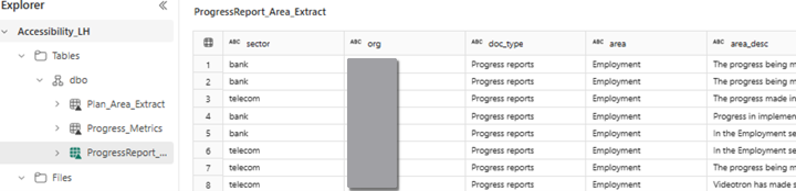

## Overview 
Accessibility Canada Act requires federally regulated organizations doing business in certain sectors and with more than 10 employees to publish accessibility plans and follow these up in a year with a progress report. the plans are required to be updated every 3 years. This is an effort to improve accommodations for people with disabilities to increase their participation and maximize their potential. 

Hundreds of regulated organizations must publish accessibility plans, each identifying unique barriers and solutions. This diversity complicates standardized monitoring and assessment of progress within mandated accessibility areas.

This project helps stakeholders - including federal regulators, inclusive service organizations, public and private sector entities- analyze accessibility progress to enable them identify gaps, and strategically realign priorities based on findings.

## Challenges in developing a solution
As we would have required integration with tools that would allow locating plans and progress reports posted by a large number of organizations on the web making the solution more complicated for implementation within the time we had, we have manually located and uploaded a few places for this MVP 

Constraints with the available token limits required getting individual responses from the OpenAI models which forced us to manually append the Json file for metrics data. 

## 1. Solution Overview
### 1.1 High-Level Design
The solution in based on the medallion architecture where we have 3 zones: 

Bronze – where the plans and progress reports are uploaded 

Silver – where we compute the data using Azure Open AI and store the results in delta tables  

Gold – where we store the Accessibility Improvement progress metrics

### 1.2 Lakehouse files
#### 1.2.1 Input files

#### 1.2.2 Processed Files

#### 1.2.3 Consolidated JSON files

#### 1.2.4 Computed Metrics files

### 1.3 Delta Tables
#### 1.3.1 Plan by Area

#### 1.3.2 Progress Report by Area

#### 1.3.3 Progress Metrics

### 1.4 Python Notebooks

#### 1.4.1 Process_Extracts
Reads plans and progress reports, generates embeddings, and extracts details based on prompts passed to Azure OpenAI gpt-4-turbo model.  

#### 1.4.2 Calculate_Progress_Metrics
Reads plans and progress reports, creates progress metrics comparing the plans versus progress reports and the prompts passed to Azure OpenAI gpt-4-turbo model.  

Note: Due to rate limit constraints metrics were created for one org at a time and the JSON file had to be manually appended. 

### 1.5 Pipelines
Data pipelines were created in Fabric to push data into delta tables.

#### 1.5.1 Process_Extracts_dp

#### 1.5.2 Load_Progress_Metrics

### 1.6 Report
